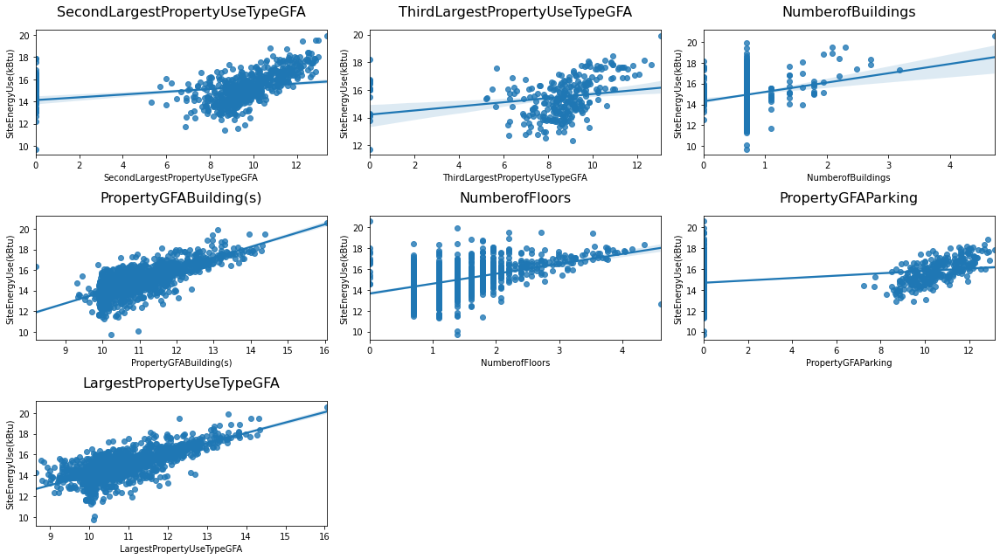
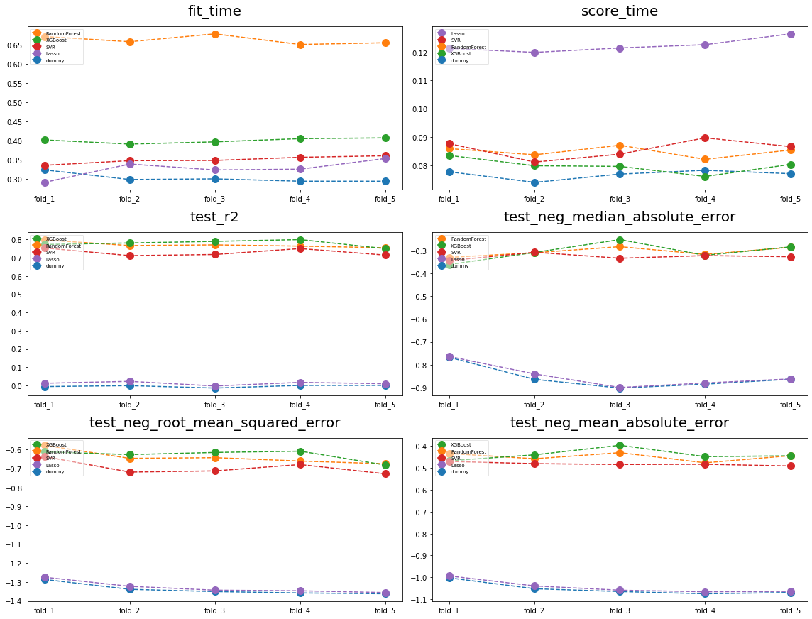

## **Project overview**

* this project consists of **estimating the model** that would predict both **CO2 emissions** and the **energy consumption** of non-residential **buildings** in the city of **Seattle**

* thus the project addresses **regression** problems with **tabular data**

* the overall performance of the **fitted model** is **robust** and the few features it needs as input allow a clear **interpretation** of the defined **model**  
&nbsp;

### **Workflow summary**

* **cleaned** the data

* **explored** the data, in particular the relationship betweenn features and targets

* implemented **feature engineering** : selection, transformation and creation of features

* compared linear vs non-linear estimators on metrics using CV

* optimized **XGBoost, RandomForest & SVR** estimators using both **GridSearchCV** and **RandomizedSearchCV**

* predicted test samples target values with **optimized XGBoost** & interpreted both **r2** score and **feature importances**
&nbsp;

&nbsp;

## Project installation

* use command pip install -r requirements.txt to install the dependencies

* the data is available [here](https://www.kaggle.com/city-of-seattle/sea-building-energy-benchmarking?select=2015-building-energy-benchmarking.csv) and in the repository in the Data folder. Only the first two files of the folder are raw data. The other files are exported dataframes from the cleaning/exploratory notebook.

* Both cleaning/exploratory & modelling notebooks can be run immediately

&nbsp;

## Detailed workflow
&nbsp;

## **Cleaning**

### **Shape**

&nbsp;

### **Duplicates**

&nbsp;

### **Missing values on targets**

&nbsp;

### **Filter on feature values**

&nbsp;

### **Target value equal to zero or negative**

&nbsp;

Data is now cleaned. The describe table above shows no incoherent value in quantitative features such as building gross floor areas, as well as energy consumption features. 

We will now split the data into a train and test set and explore it to get insights.
&nbsp;

## **Exploration**

### **Missing values**

&nbsp;

Missing values tables show that the data is pretty well filled. The majority of columns are almost 100% fulfilled, and there are no empty lines neither. It is likely we will not have imputation issues with this dataset.

### **Univariate exploration**

#### **Targets**

&nbsp;

* The target distributions are strongly skewed, with some outliers that have significantly high values compared to the majority of samples. 
* These outliers may lead to overfitted and less generalizable models
* Therefore we will perform a log transformation on the targets to normalize the distributions
* Models will be trained on log-transformed targets
&nbsp;

&nbsp;

#### **Size features**

&nbsp;

* As for the targets, the majority of distributions are highly skewed to the right, with some samples having significantly superior values.
* As for the targets, a log-transformation will be needed here to prevent estimator overfitting on very few samples.

&nbsp;

Most of the distributions after log-transformation are more Gaussian-like
&nbsp;

### **Bivariate/multivariate exploration**

#### **Targets**
&nbsp;

&nbsp;

There is a clear positive linear relationship between the two targets. Therefore we are confident that relevant features for predicting one of the two will help predict the other.
&nbsp;

#### **Size features**
&nbsp;

&nbsp;

Some features seem to have a positive linear relationship with the energy consumption target. There may be some correlation between these features though. Let's check it with PCA.
&nbsp;

#### **PCA on size features**

&nbsp;

Property GFA Building & Largest Property Use Type GFA seem strongly positively correlated by looking at the correlation circle. Thay have pretty the same direction and length. 

&nbsp;

### **Energy sources features**

As we have information about each enery source consumption for ach building, we will generate two sorts of features by transforming the 'energy source' features(eg. 'Electricity', 'Steam'...) into :
* a categorical feature : main energy source of the building (3 classes)
* three binary features for each energy source: whether the energy source is used in the building or not

#### **Source energy vs building size**

&nbsp;

We can see on the boxplots that the buildings which use Steam as main source of energy tend to have higher consumption values on both targets. 
* But does the energy source have an impact ? 
* Or is it just the buildings that use Steam are bigger than the others ?

&nbsp;

* The plot here shows that, for a given building size, buildings which use Steam as main source of energy tend to have higher values on energy consumption.
* This suggests that the features created are relevant and might help estimators when fitting a model.

The insight is even clearer for co2 emissions. For a given building size, buildings which use Steam as main energy source tend to have significantly superior co2 emissions than electricity-driven buildings.
&nbsp;

#### **Bulding type features**

We assume here that building type features may be relevant here to explain target values. We will produce some plots to get insights on these features.

&nbsp;

We can see that Campuses tend to have on both targets higher values than the rest of classes. 
* Again, are Campuses just bigger than the other building types? 
* Or do they use more Steam than the other buildings ?

&nbsp;

* We can see that for a given building size, that uses Electricity or Natural gas as main source of energy, Campuses tend to have superior energy consumption values than the rest of buildings.

* This suggests that the building type features are relevant to predict the targets and may help an estimator.
&nbsp;

&nbsp;

&nbsp;

These two features, more precise than Building Type, with a higher number of classes, seem also relevant. The distributions of the targets can vary a lot accross classes.
&nbsp;

### **Features selection : relevant features**

Consequently to this exploration and according to our intuition, we will keep the following features for the modelling stage.
* size_features  : 
    * Number_of_buildings, 
    * PropertyGFABuilding(s)
    * Number_of_floors, 
    * Property_GFA_parking
* energy_source_features : 
    * Electricity,
    * Natural Gas
    * Steam
* building type features : 
    * BuildingType
    * PrimaryPropertyType
    * LargestPropertyUseType

We will also keep YearBuilt & ENERGYStarSCORE features which might be relevant
&nbsp;

#### **Missing values**

&nbsp;

We can see that the fulfillment ratio for the relevant features in the dataset is nearly optimal.

* We will have to impute ENERGYSTARScore missing values (~34% NaNs). Median imputation will be a good choice. Median imputation allows to preserve the central tendency of a distribution when there are outliers. 34% Nans ratio is acceptable. The distribution will not be completely distorted since the majority of values remain actual.

* Some few lines missing on LargestPropertyUseType : median imputation will be fine.
&nbsp;

## **Modelling**
&nbsp;

### **Targets : log-transformation**
&nbsp;

&nbsp;

### **Pipelines**
&nbsp;

We will now set the Pipelines containing the estimators. These will include :
* appropriate encoders for categorical features
* a custom log-transformer for the size features
* a custom transformer for the energy source features 

#### **Categorical features encoding**

&nbsp;

**Comments:**
* **BuildingType** & **main_energy_source** have a **low number of classes** (4 and 3). These two features are **unordered** since there is no induced order in the labels. **One-hot-encoding** may be a good option here since it will not create too many columns. Also one-hot-encoding is an unsupervised encoder (does not take into account the target values) which may prevent from overfitting.

* **PrimaryPropertyType** & **LargestPropertyUseType** have a pretty **high number of unordered categories**. One-hot encoding would lead to a great amount of **sparse columns**, which should be avoided. **Target encoding** seems an interesting solution. However a high number of classes, for a given number of samples, means that some categories are represented by a *very few number of samples*. Target encoding could lead in these cases to **overfitting**. Fortunately the Target Encoder class includes a **smoothing** parameter that will produce a **weighted-average** between target value for each category and target mean value, to prevent again from overfitting.
&nbsp;

#### **Energy Site Use**

* The target we will consider in the next modelling steps will be **Site Energy Use**
* Since the two targets appear to be **highly correlated**, we will **fit a best estimator** to predict the Energy Site target values
* This estimator will then serve to predict the CO2 emissions of the test samples
&nbsp;

#### **Estimators**

We will train various estimators to compare their performance.

* Linear estimators : Linear Regression, Lasso, SupportVectorRegressor
* Non linear : RandomForest, Gradient Booosting
* Dummy regressor

We will compare in this step the estimators's performance on commonly used metrics for regression using Cross-validation method.

* Metrics:
    * r2
    * median absolute error
    * mean absolute error
    * rmse
    * fitting & score time

&nbsp;

Linear Regression performance on fold_4 seems to be distorted by few badly-predicted samples, with a highly-negative value for R2. 
* This estimator is very sensitive to potential outliers, when fitting as well as when predicting. 
*Its score on median absolute error shows that its predictions are quite well centered though, with low bias, even if other estimators perform better. 

* However we will perform again this step excluding Linear Regression

&nbsp;

Ensemble non linear models, XGBoost & RandomForest, are the most performing accross the selected metrics.
* Support Vector Machines also performs well.
* We will now see how these models tend to overfit when training by comparing their train/test scores. 

&nbsp;

RandomForest tends to perform better than XGBoost on training sets and quite less on validation sets.
&nbsp;

#### **Optimizing best models: XGBoost, RandomForest& SVR**

We will now optimize the best three estimators: 
* XGBoost
* RandomForest
* SVR
* The metric on which the estimators will be optimized is R2. It is a scale-free metric, easy to interpret (the closer to 1 the better). Optimizing R2 is equivalent to optimizing RMSE or MSE.
&nbsp;

#### **Optimized vs non optimized estimators**

&nbsp;

The **optimized XGBoost** is our best estimator. It performs better than the others accross different metrics, ie on R2 as well as median_absolute_error.
&nbsp;

#### **XGBoost full optimization**

&nbsp;

### **Test set : predictions**

&nbsp;

* The model **generalizes** well
* The score of predictions on test set is slighly inferior to mean score on validation folds ~ **0.77** vs ~ 0.79

#### **Visualizing predictions**
&nbsp;

* The overall impression is that observations are pretty **well centered** accross the two sides of the line.
* However we can see that the samples with **lowest values** on target have prediction values **higher than expected** and may reduce the score of predictions.
&nbsp;

#### **Prediction score per building type**
&nbsp;

* The score of predictions on the most represented category is pretty equal to the overall score.
* The model is less accurate on predicting **NonresidentialCOS** buildings.
&nbsp;

### **Total GHGE Emissions (CO2 emissions)**

&nbsp;

#### **Visualizing predictions**

&nbsp;

* The plot confirms the high score on predictions.
* As for the energy consumption target, some of the samples with lowest values on the target are overpredicted by the model.

&nbsp;

* As for the energy consumption target, the score of predictions on the most represented category is pretty equal to the overall score.
* The model is more accurate to predict CO2 emissions of NonresidentialCOS buildings than their energy consumption value.
&nbsp;

### **Feature importances**

#### **Energy Site Use**
&nbsp;

&nbsp;

#### **CO2 emissions**
&nbsp;

&nbsp;

Comments : 
* **Property GFA Building** is by far the most important feature to predict both targets. It is the feature that generates most of the splits when growing the trees. 
* **Building type** features are also relevant.
* **Energy source** features are more relevant to predict CO2 emissions than energy consumption
&nbsp;

&nbsp;

## **Conclusion**

* We achieved estimating **robust and generalizable** models to predict both **energy consumption** & **co2 emissions** targets 
* The features in the data are **relevant**, as **various estimators** could achieve a solid performance on most commonly used metrics to evaluate the quality of a **regression**
* An **optimized version of XGBoost** is the most performing among all the estimators we tested in this workflow
* By far **the most important feature is the size of the buildings** for both targets, even though Energy sources and building type also proved to be useful
* Further research may add relevant features, do more **feature engineering** and **try other estimators** too

